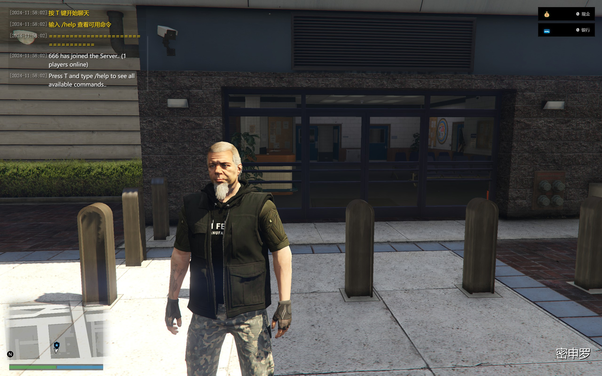
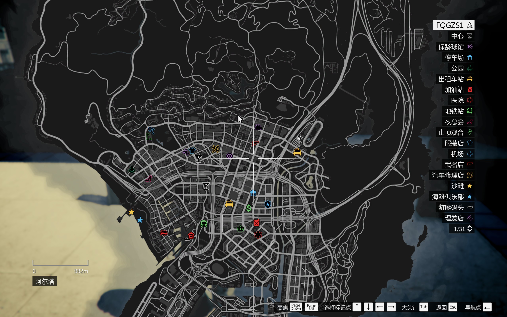

# 风启市服务器

GTA5 alt:V 多人联机服务器项目。

## 项目结构
resources/
├── chat/ # 聊天系统资源
│ ├── client/ # 客户端代码
│ │ ├── ui/ # UI相关代码
│ │ │ ├── index.html # UI主页面
│ │ │ ├── styles.css # UI样式
│ │ │ ├── index.js # UI主逻辑
│ │ │ ├── chat.js # 聊天UI逻辑
│ │ │ └── money.js # 金钱UI逻辑
│ │ └── textSelection.js # 文本选择功能
│ ├── server/ # 服务端代码
│ │ ├── index.js # 服务端入口
│ │ ├── server.js # 服务器核心逻辑
│ │ ├── commands.js # 命令处理
│ │ ├── commandHandler.js # 命令处理器
│ │ ├── vehicleHandler.js # 载具处理器
│ │ ├── spawnHandler.js # 出生点处理器
│ │ ├── vehicles.js # 载具数据
│ │ └── money.js # 金钱系统
│ └── resource.cfg # 资源配置文件
└── freeroam/ # 自由模式资源
└── server/
└── index.js # 自由模式服务端逻辑

## 功能特性

- 聊天系统
  - 支持命令输入
  - 支持文字选择和复制
  - 支持 Ctrl+A 全选
  - 彩色消息显示

- 载具系统
  - 支持生成各类载具
  - 载具数量限制
  - 自动进入载具
  - 载具删除功能

- 出生系统
  - 统一的出生点（警局）
  - 死亡重生机制
  - 玩家状态管理

- UI系统
  - 聊天界面
  - 金钱显示
  - 消息提示

## 更新日志

### 2024-01-xx v0.0.1
- 初始化项目结构
- 添加基础聊天系统
- 添加载具生成系统
- 添加出生点系统

### 2024-01-xx v0.0.2

- 统一出生点到警局
- 修复重复生成载具的问题
- 改进文字选择功能
- 优化UI系统结构

### 2024-01-xx v0.0.3

- 添加完整的中文注释
- 统一命令处理系统
- 改进消息广播机制
- 优化代码结构

## 待办事项
- [ ] 添加更多游戏功能
- [ ] 完善权限系统
- [ ] 添加数据持久化
- [ ] 优化性能
- [ ] 添加更多自定义功能

## 注意事项
- 确保 alt:V 服务器版本兼容
- 正确配置 resource.cfg
- 遵循代码规范和注释规范